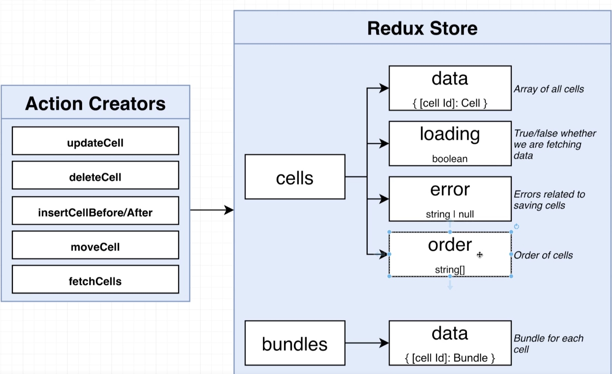
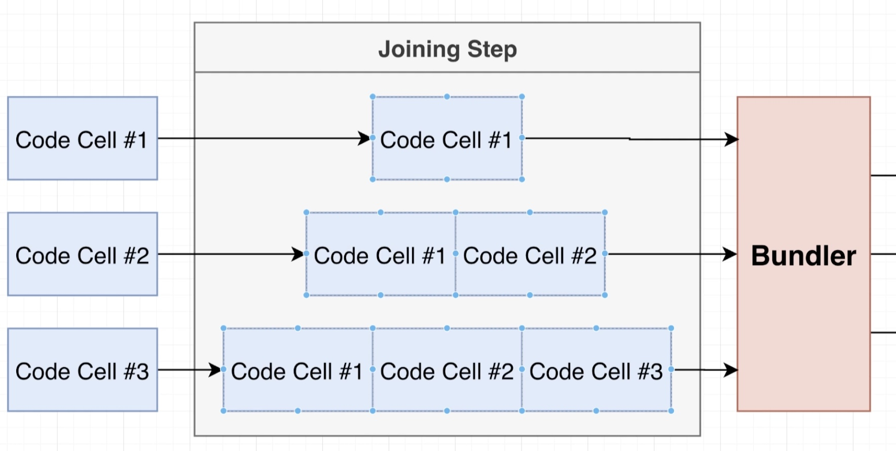
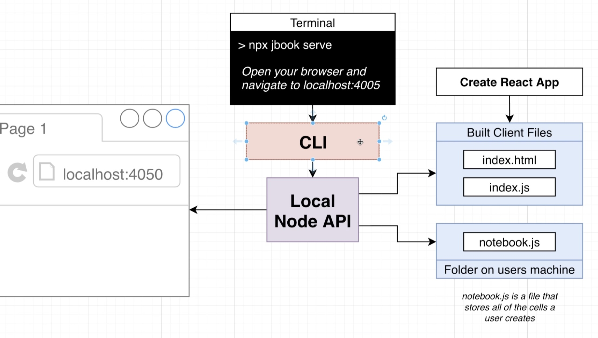
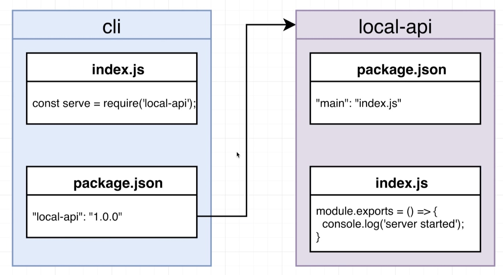

# Jupiter-Notebook-like Code Editor

- Author: Seokhyun Wie (Brandon)
- Email: brandonwie.cs@gmail.com
- Course: [Udemy](https://www.udemy.com/course/react-and-typescript-build-a-portfolio-project/)

[](https://www.typescriptlang.)
[](https://reactjs.org/)
[](https://redux.js.org/)
[](https://github.com/evanw/esbuild)
[](https://www.npmjs.com/package/@uiw/react-markdown-editor)
[](https://github.com/brandonwie/jbook-ts-react)

## How to run

> `$ jbook serve`

Navigate to <http://localhost:4005> to edit.

# Development Notes

## What am I building?

A CLI to launch an interactive development environment for writing and documenting code.
Support JS, and MarkDown

## Challenges

1. Code will be provided to Preview as a string. We have to execute it safely [How to solve?](#execution)
2. This code might have advanced JS syntax in it (like JSX) that your browser can't execute [How to solve?](#transpiler-babel)
3. The code might have import statements for other JS files or CSS. We have to deal with those import statements before executing the code [How to Solve?](#webpack---bundler)

---

## **_Babel_** - Transpiler

- Problem #2 would be solved if we could get Babel working in our React app
- Take a look at existing apps online and see how they use babel:
  - [codepen.io](https://codepen.io): Backend API Server
  - [babeljs.io](https://babeljs.io): In-Browser Transpiler

### JavaScript Modules

```javascript
// message.js
export default 'Hello there!';
```

```javascript
// index.js
import message from './message';
console.log(message);
```

- AMD: `define(['dep'], (dep) => {});`
- common js: `require()`, `module.exports`
- ES Modules: `import a from 'a'`, `export default 123`;

### Transpile Example with Babel

```javascript
import React from 'react';
```

=> Transpiled by `Babel`

```javascript
const React = require('react');
module.exports = App;
```

---

## **_Webpack_** - Bundler

Single file containing both modules linked together in some way

it can deal with both `common js` and `ES Modules`

### How to find all the modules the user has imported from NPM?

1. Webpack throws an error if the modules is not installed locally (in case using Backend API) => **NpmInstallWebpackPlugin** (NPM Registry) : `npm install` automatically

2. Make manual request: doesn't install React as an entire dependency

3. Same as #2, but don't use API (No Backend)

### Remote? Local?

- Remote: cache NPM modules to bundle faster / better for users with slow device or limited connection
- Local: fast execution / no need for API server / less complexity

### **Webpack doesn't work in the browser**

---

## esbuild-wasm NPM module

- ESBuild can transpile + bundle code all in the browser.
  Small amount of JS(user input) => WASM (Go Lang bundler compiled to work in the browser)
- It is primarily intended to only be used in the browser. ([documentation](https://esbuild.github.io/getting-started/#install-the-wasm-version))

### ESBuild Bundling Process

1. Find where the `index.js` is stored (onResolve)
2. Attemp to load up the `index.js` file (onLoad)
3. Parse the `index.js` file, find any import/require/exports
4. If there's any import/require/exports, figure out where the requested file is (onResolve) => UNPKG
5. Attemp to load up the file

### Used localforage (indexedDB) to cache

### UNPKG

`unpkg.com/packageName`

- Get around with CORS when installing NPM packages
- Automatically find latest version

## Execution

### Consideration Around Code Execution

- User-provided code might throw errors and cause our program to crash
- User-provided code might mutate the DOM, causing our program to crash
- A use might accidentally run code provided by another malicious user

### **iframe** as solution

- iframe allow communication between the parent and the child

```js
parent.a; // from child html
document.querySelector('iframe').contentWindow; // from parent to child
```

- Direct access between frames is allowed when the iframe element does not have a 'sandbox' property, or has a 'sandbox="allow-same-origin"' property
- Domain, Port, and Protocol (http vs https) have to be the exact same

- We don't use additional server to prevent direct access (as codepen.io), but we use `sandbox=''` to isolate the iframe

### **SrcDocs**

- An attribute of iframe
- troubleshooting: nested script tags cause an error
  - use `window.postMessage()`

### Downside of using single port for all

- Cannot use a couple of features as localStorage
- However, it's ignored for the sake of performance and convenience

---

## Open-source Browser-based Editors

1. CodeMirror: easy, doesn't have out-of-the-box features
2. Ace Editor: moderately easy, widely used
3. **_Monaco Editor_**: hardest to setup, gives almost-perfect editing experience

## Monaco Editor

- `@monaco-editor/react`: main editor
- `monaco-editor`: Typescript types
- `prettier`: integration for formatting
- `bulmaswatch`: CDN CSS Library

### JSX Syntax Highlighting

- [monaco-jsx-highlighter](https://www.npmjs.com/package/monaco-jsx-highlighter)

### Resize Panes

- [react-resizable](https://www.npmjs.com/package/react-resizable)

---

## Markdown Editor

- [@uiw-react-md-editor v2.1.1](https://www.npmjs.com/package/@uiw/react-md-editor)

- Resizer is included
- Will have a conflict with bulmacss `.title` class: check out `./src/scss/components/_TextEditor.scss`

---

## Redux

### Structure



### [Immer](https://immerjs.github.io/immer/)

- cleaner code for reducer
- No need to pass initialState inside reducer, but pass it as second argument in `produce()` function (to resolve unexpected `undefined` type error on states)

### [Font Awesome](https://www.npmjs.com/package/@fortawesome/fontawesome-free)

- css of icons

### useMemo

- to assist bindActionCreators from being executed infinitely (src/hooks/use-actions.ts)

---

## Cumulative Code Execution

connect two or more different cells so the later cell can use variables in the previous cell


---

## Local Node API



separate NPM packages

- CLI: jbook
- Local Express API: @jbook/local-api
- Public Express API: @jbook/public-api
- React App: @jbook/local-client

## Lerna CLI

Tool for managing a multi-package project

- Lerna | Yarn Workspaces | NPM Workspaces | Bolt | Luigi
- Lerna - v3.22.1 is used
- bootstrap mapping
  

### Add TypeScript support

- In `/packages` folder, go to every sub packages' folder and run `npx typescript --init` and `lerna add typescript --dev --scope=packageNames`
- open `tsconfig.json` set outDir to `./dist`
- In `/local-api` package, inside `tsconfig.json` you need to set `declaration` to `true`
- In the root directory, go to `package.json` and add script `"start": "lerna run start --parallel"`, it will run all packages concurrently

### Connect packages

- the application is in `/packages/local-client`

- `/packages/cli`: has `local-api` as a dependency
- `/packages/local-api`: has `local-client` as a dependency
- `/packages/local-client`: has the application
